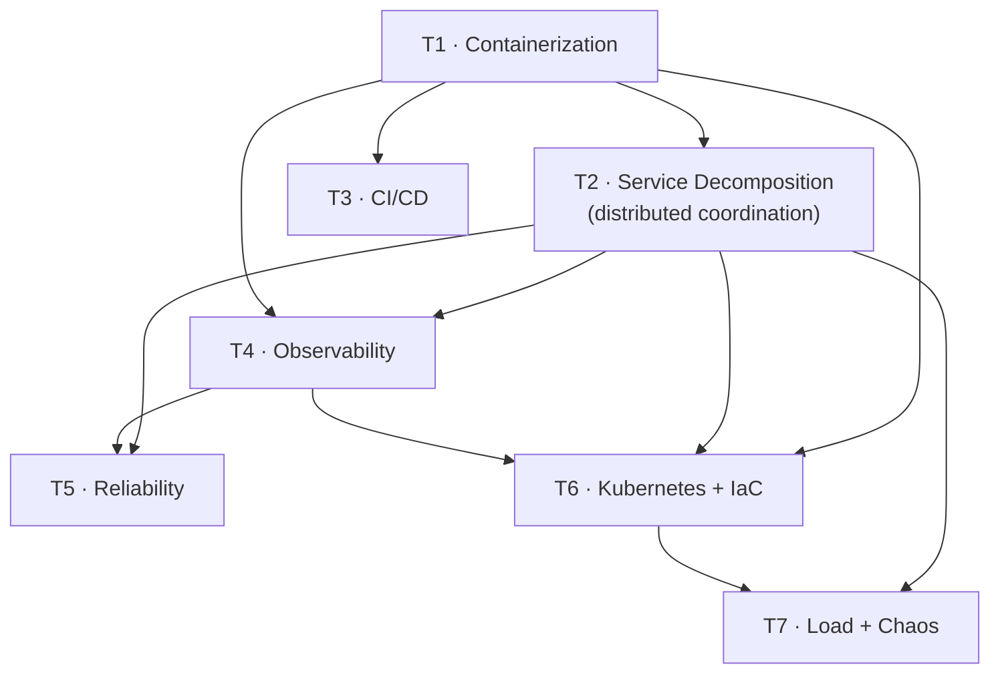

# SupportHub — DevOps & Distributed Systems Roadmap

A phased, resume‑oriented plan to evolve SupportHub from a single‑process modular monolith into a
**containerized, horizontally‑scalable, observable, production‑grade distributed system** — using only
**free / local** tooling (Docker, Redis, Postgres, GitHub Actions, Prometheus/Grafana, k6, kind/minikube).

Each tier is a **standalone plan** you can pick up and finish independently. This file is the index:
it gives the narrative, the dependency graph, the combined résumé story, and how each tier maps to a
**real gap** identified in [`../architecture-review/`](../architecture-review/).

---

## The narrative (what this whole roadmap proves on a résumé)

> "I took a working modular‑monolith SaaS and made it production‑grade: containerized the pnpm/Turbo
> monorepo, **decomposed it into independently‑scalable web and worker tiers**, solved the distributed
> coordination problems that creates (leader‑elected scheduling, cross‑process real‑time fan‑out,
> idempotent jobs), wrapped it in **CI/CD**, made it **observable** (metrics, logs, traces), hardened
> it for **failure** (DLQ, graceful shutdown, health‑gated rollouts), deployed it to **Kubernetes with
> autoscaling driven by queue depth**, and **load‑/chaos‑tested** it to prove the scaling actually
> works."

That single sentence touches: Docker, container orchestration, distributed coordination, CI/CD,
observability, SRE/reliability, IaC, autoscaling, performance engineering, and chaos engineering.

---

## Tier index

| Tier | Plan | Goal | Primary skill | Effort | Depends on | Cost |
|------|------|------|---------------|--------|-----------|------|
| **T1** | [tier-1-containerization.md](./tier-1-containerization.md) | Containerize monorepo + full local stack via Docker Compose | DevOps | S–M | — | Free/local |
| **T2** | [tier-2-service-decomposition.md](./tier-2-service-decomposition.md) | Split web/worker tiers + leader‑elected cron + multi‑replica Socket.IO + idempotency | Distributed Systems | M–L | T1 | Free/local |
| **T3** | [tier-3-ci-cd.md](./tier-3-ci-cd.md) | GitHub Actions: lint → typecheck → migrate → build → image → deploy | DevOps / CI‑CD | M | T1 | Free |
| **T4** | [tier-4-observability.md](./tier-4-observability.md) | Prometheus + Grafana + OpenTelemetry traces + structured logs + health probes | Observability / SRE | M–L | T1, T2 | Free/local |
| **T5** | [tier-5-reliability.md](./tier-5-reliability.md) | DLQ + alerting, retries/backoff, graceful shutdown, race fixes, HA topology | SRE / Reliability | M | T2, T4 | Free/local |
| **T6** | [tier-6-kubernetes-iac.md](./tier-6-kubernetes-iac.md) | Kubernetes (kind/minikube) + Helm + HPA on queue depth + Terraform | Orchestration / IaC | L | T1, T2, T4 | Free/local |
| **T7** | [tier-7-load-chaos-testing.md](./tier-7-load-chaos-testing.md) | k6 load tests + chaos experiments + before/after benchmarks | Performance / Chaos | M | T2, T6 | Free/local |

`S ≈ 1–2 days · M ≈ 3–5 days · L ≈ 1–2 weeks` (part‑time).

---

## Dependency graph & recommended sequence

**Recommended order:** T1 → T2 → T3 → T4 → T5 → T6 → T7.
**Minimum high‑impact slice (if time‑boxed):** T1 + T2 + T4 — containerize, make it horizontally
scalable, and prove it with dashboards. That alone is a complete, defensible portfolio story.

---

## How each tier maps to a real codebase gap

Every tier fixes something the architecture review actually flagged — so the work is **honest** and
you can speak to it in depth in interviews.

| Real gap (from architecture‑review) | Fixed in |
|-------------------------------------|----------|
| No Dockerfiles / no reproducible deploy | T1 |
| API process runs HTTP + Socket.IO + 2 BullMQ workers + cron together | T2 |
| Socket.IO rooms are in‑memory → can't run >1 replica | T2 |
| node‑cron fires on every replica → duplicate Gmail/Outlook renewals | T2 (leader election) |
| `ticketNumber = MAX+1` race under concurrency | T2/T5 |
| No CI/CD pipeline | T3 |
| No metrics, no tracing (only pino logs + `requestId`) | T4 |
| Failed BullMQ jobs just sit in the failed set; no DLQ/alerting | T5 |
| No graceful shutdown (in‑flight jobs/requests dropped on deploy) | T5 |
| Single Redis / single Postgres SPOF | T5 (topology), T6 |
| No orchestration, no autoscaling, no IaC | T6 |
| Scaling claims never measured | T7 |

---

## Consolidated résumé bullets (pick the strongest 3–4)

- **Containerized** a pnpm/Turborepo TypeScript monorepo with multi‑stage Docker builds and a
  five‑service Docker Compose stack (Postgres, Redis, web‑API, worker, frontend).
- **Decomposed** a single Node process into independently‑scalable **web** and **worker** tiers; solved
  the resulting distributed problems with **Redis‑based leader election** for scheduled jobs and a
  **Socket.IO Redis adapter/emitter** for cross‑process real‑time fan‑out, enabling N‑replica
  deployment.
- Built a **GitHub Actions CI/CD** pipeline (lint, type‑check, Prisma migrations, multi‑arch image
  build & push) with health‑gated rollout.
- Instrumented an event‑driven pipeline with **Prometheus/Grafana** and **OpenTelemetry distributed
  tracing** spanning HTTP → BullMQ → external APIs; dashboards for queue depth, job latency, and
  classification time.
- Hardened the async pipeline with a **dead‑letter queue, exponential‑backoff retries, idempotency
  keys, and graceful shutdown**; eliminated a read‑modify‑write race in per‑tenant sequence generation.
- Deployed to **Kubernetes** with a **Helm** chart and **Horizontal Pod Autoscaling driven by Redis
  queue depth**; provisioned managed infra with **Terraform**.
- **Load‑tested with k6** and ran **chaos experiments** (worker kill, Redis failover) to prove
  horizontal scaling and graceful recovery — documented before/after throughput.

---

## Conventions used across tier plans

- **Definition of Done** for every tier is a *demoable* artifact (a command to run, a dashboard to
  open, a screenshot to capture) — because portfolios need evidence, not prose.
- All tooling is **free and runs locally**; cloud is optional and clearly marked.
- Each plan lists **files to create/modify** so you (or an agent) can execute it directly.
- Status legend you can track inline: `[ ] todo · [~] in progress · [x] done`.
</content>
