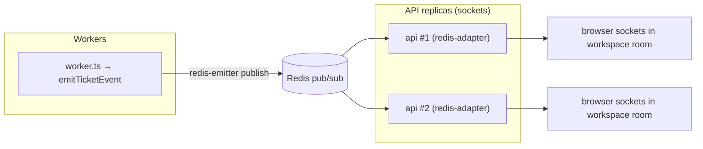
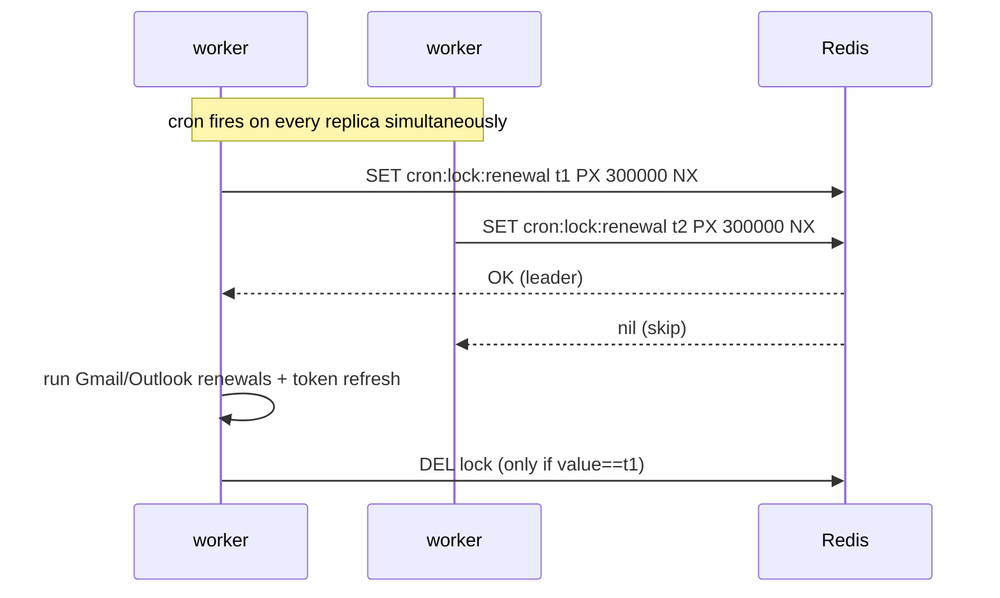

# Tier 2 — Service Decomposition & Distributed Coordination

> **Goal:** Split the single Node process into independently‑scalable **web** and **worker** tiers, and
> solve the distributed‑systems problems that creates. **Primary skill:** Distributed Systems.
> **Effort:** M–L. **Depends on:** T1. **Cost:** free / local.

## Why this tier (real gap)

Today `apps/api/src/index.ts` starts **everything in one process**: the Express API, the Socket.IO
server, _both_ BullMQ workers, and the node‑cron renewal job. That has three concrete distributed
defects the moment you run more than one replica:

1. **Socket.IO rooms are in‑memory** (`lib/socket.ts`) → an event emitted on replica A never reaches a
   socket connected to replica B.
2. **node‑cron runs in every replica** (`cron/renewal.cron.ts`) → N replicas = N concurrent Gmail/
   Outlook renewals (duplicate API calls, wasted quota, race on token rows).
3. Workers compete with HTTP traffic for the same event loop, and a crash takes everything down.

This is **the** distributed‑systems centerpiece of the roadmap.

## Status (as of 2026-06-28)

**Done.** The process split is implemented and backward‑compatible:

- **Process split** — new `apps/api/src/worker.ts` runs the BullMQ workers + renewal cron with
  no HTTP/Socket.IO. `index.ts` gates them behind `RUN_BACKGROUND_WORKERS` (default keeps `pnpm dev`
  and the single‑box prod deploy as one process). Scripts `dev:worker` / `start:worker` added.
- **Cross‑process real‑time** — `socket.ts` attaches the `@socket.io/redis-adapter` on API replicas
  and `emitTicketEvent` falls back to a `@socket.io/redis-emitter` when there's no local `io`
  (worker process) — so worker‑emitted events reach browser sockets on any replica.
- **Leader‑elected cron** — `renewal.cron.ts` wraps each tick in a Redis `SET … NX PX` lock
  (10‑min TTL) with a Lua compare‑and‑delete release; only the lock winner runs the renewal.
- **`ticketNumber` race** — replaced `MAX+1` read‑then‑insert with `createWithTicketNumber()`
  (`lib/ticket-number.ts`): optimistic insert + retry on `P2002`, no schema change.
- **Graceful shutdown** — both entrypoints handle SIGTERM/SIGINT: drain BullMQ workers, then
  disconnect Redis/Prisma.
- **Compose** — `docker-compose.prod.yml` gained an opt‑in `worker` service (profile `scaled`);
  default `up -d` stays single‑process.

Verified: `pnpm --filter api typecheck` + `build` clean, worker entrypoint boots. **Still to demo:**
the multi‑replica leader‑election / cross‑process‑emit / concurrency tests in the DoD (best run
against a local full stack once T1's `docker-compose.full.yml` lands).

## Résumé value

- "Decomposed a monolithic Node service into web and worker tiers; implemented **Redis‑based leader
  election** for scheduled work (exactly‑once across replicas) and a **Socket.IO Redis adapter +
  emitter** so events produced in worker processes fan out to sockets on every API replica — unlocking
  horizontal scaling."

## Scope

**In:** worker entrypoint, env‑gated worker startup in the API, leader‑elected cron, Socket.IO Redis
adapter (API side) + Redis emitter (worker side), idempotency/race hardening for `ticketNumber`,
graceful shutdown hooks (basic).
**Out:** DLQ/alerting (T5), metrics (T4), K8s HPA (T6).

## Plan / tasks

### A. Process split

1. **`[x]` New worker entrypoint** — `apps/api/src/worker.ts`: load env, start `startEmailWorker()`,
   `startAIClassificationWorker()`, `startRenewalCron()`; **no HTTP/Socket.IO server**; attach
   `unhandledRejection` / `uncaughtException` handlers.
2. **`[x]` Gate workers in the API** — in `index.ts`, only start workers/cron when
   `process.env.RUN_BACKGROUND_WORKERS !== "false"`. Default (unset) keeps `pnpm dev` as a single
   process (backward compatible); Compose/K8s set `RUN_BACKGROUND_WORKERS=false` on the API and run
   `worker.ts` separately.
3. **`[x]` Scripts** — add `"dev:worker": "tsx watch src/worker.ts"` and
   `"start:worker": "node dist/worker.js"` to `apps/api/package.json`.

### B. Cross‑process real‑time (Socket.IO Redis adapter/emitter)

4. **`[x]` Add deps** — `@socket.io/redis-adapter`, `@socket.io/redis-emitter`; update lockfile.
5. **`[x]` API side** — in `initSocketIO()` attach `io.adapter(createAdapter(pub, sub))` using
   `redis.duplicate()` clients. Now multiple API replicas share rooms.
6. **`[x]` Worker side** — refactor `emitTicketEvent()` so it works from any process: if `io` exists
   (monolith/API) emit via `io.to(room)`; otherwise emit via a lazy `@socket.io/redis-emitter` `Emitter`
   bound to `redis.duplicate()`. Worker‑produced `ticket:created/tagged/assigned` events now reach
   browser sockets through Redis.

### C. Leader‑elected scheduling

7. **`[x]` Wrap the cron tick in a Redis lock** — in `renewal.cron.ts`, on each fire attempt
   `SET cron:lock:renewal <token> PX <ttl> NX`. Only the lock winner runs the renewal body; others log
   "skipped — another instance holds the lock". Release the lock in `finally` only if the token still
   matches (avoid releasing someone else's lock). Result: **exactly‑one runner per tick** regardless of
   replica count.

### D. Idempotency / correctness hardening

8. **`[x]` Fix the `ticketNumber` race** — replace `MAX(ticketNumber)+1` read‑then‑insert (in
   `ticket.service.ts` and `email-processor.ts`) with one of: a Postgres sequence per workspace, a
   `$transaction` + retry on `P2002`, or a Redis `INCR` counter keyed by workspace. Document the
   trade‑off (sequence = simplest + DB‑native).
9. **`[x]` Confirm job idempotency holds under the split** — re‑verify BullMQ `jobId` dedup +
   `@@unique([messageId, workspaceId])` still make retries safe across multiple worker replicas (they
   do; document why).

### E. Graceful shutdown (basic)

10. **`[x]` SIGTERM handling** — on `SIGTERM`/`SIGINT`: stop accepting new work, `worker.close()` BullMQ
    workers (let in‑flight jobs finish), close the HTTP server, disconnect Redis/Prisma. (Deepened in T5.)

## Definition of Done (demoable)

- `docker compose ... up -d --scale worker=3` + tail logs: a cron tick shows **one** "running renewal"
  and the other two log "skipped — lock held".
- Connect a browser socket to API replica A; trigger a ticket event from a worker → the browser
  receives it (proves cross‑process fan‑out via Redis).
- Concurrency test: fire N simultaneous ticket creates in one workspace → **no duplicate `ticketNumber`
  and no lost inserts** (proves the race fix).
- `pnpm dev` still runs the whole app in one process (backward compatibility preserved).

## Risks & gotchas

- ioredis pub/sub connections **must be separate** from the command connection → always `redis.duplicate()`
  for the adapter and the emitter.
- Adapter and emitter must share the same namespace/prefix (defaults match) or events won't route.
- Lock TTL must exceed the worst‑case renewal runtime, or a slow leader's lock expires mid‑run and a
  second runner starts. Size it generously (e.g. 5 min) and/or renew the lock.
- Keep the env default backward‑compatible so local DX doesn't regress.

## Cost

100% free and local (Redis is already in the stack).
</content>
