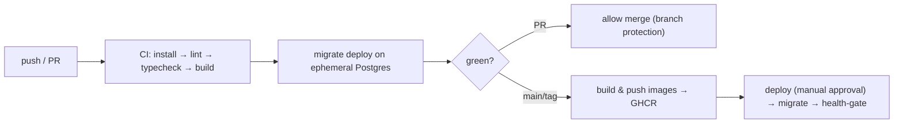

# Tier 3 — CI/CD Automation

> **Goal:** A GitHub Actions pipeline that validates, builds, and ships the monorepo on every push/PR.
> **Primary skill:** DevOps / CI‑CD. **Effort:** M. **Depends on:** T1. **Cost:** free (GitHub Actions
> free tier).

## Why this tier (real gap)

There is **no CI/CD** in the repo — no `.github/workflows`, no automated lint/typecheck/test/build, no
image publishing. Husky + lint‑staged run locally only. Quality and deployment are entirely manual.

## Résumé value

- "Built a GitHub Actions CI/CD pipeline for a pnpm/Turborepo monorepo with Turbo remote‑cache‑style
  affected builds, Prisma migration checks, multi‑stage Docker image build & push to GHCR, and a
  health‑gated deploy step."

## Scope

**In:** CI workflow (install → lint → typecheck → build, using Turbo + pnpm cache), DB migration
validation against an ephemeral Postgres service, Docker build & push to GitHub Container Registry
(GHCR), branch protections, a deploy job (manual/`workflow_dispatch` or to a free host).
**Out:** full e2e test suite (none exists yet — note as a follow‑up), production cloud account.

## Plan / tasks

1. **`[ ]` CI workflow** — `.github/workflows/ci.yml`, on `push`/`pull_request`:
   - `pnpm/action-setup` + `actions/setup-node@20` with `cache: pnpm`.
   - `pnpm install --frozen-lockfile`.
   - `pnpm lint`, `pnpm -w turbo run check-types` (or `typecheck`), `pnpm build`.
   - Cache `.turbo` between runs for incremental builds.
2. **`[ ]` Migration check job** — spin up `services: postgres:16-alpine`, run
   `pnpm --filter api exec prisma migrate deploy` against it to prove migrations apply from clean, and
   `prisma migrate diff`/`migrate status` to catch drift (schema vs migrations).
3. **`[ ]` Image build & push** — `.github/workflows/release.yml`, on tag/`main`:
   - `docker/setup-buildx-action`, `docker/login-action` (GHCR, `GITHUB_TOKEN`),
     `docker/build-push-action` for `apps/api` and `apps/web`.
   - Tag images with `sha`, `latest`, and semver; enable build cache (`cache-from/to: type=gha`).
   - (Optional) multi‑arch `linux/amd64,linux/arm64`.
4. **`[ ]` Deploy job** — gated behind `environment: production` (manual approval). Target a free host
   (Render/Railway/Fly free tier) or just `workflow_dispatch` that runs `prisma migrate deploy` then
   restarts services. Health‑gate on `GET /api/health`.
5. **`[ ]` Repo hygiene** — branch protection requiring CI green; status badges in the root README;
   Dependabot/`pnpm audit` step.
6. **`[ ]` Secrets** — store `DATABASE_URL`, JWT/encryption keys, OAuth creds as GitHub Actions secrets;
   never in the image.

## Pipeline shape

## Definition of Done (demoable)

- A PR shows the CI checks running and required‑to‑merge.
- A merge to `main` publishes `ghcr.io/<you>/supporthub-api:<sha>` and `-web:<sha>`.
- The README shows passing CI badges.
- The deploy job demonstrates `prisma migrate deploy` + health check gating.

## Risks & gotchas

- pnpm workspace caching: cache the pnpm store **and** `.turbo` for real speedups.
- `--frozen-lockfile` fails if the lockfile is stale — keep it committed and current (esp. after T2 adds
  the Socket.IO Redis deps).
- Don't run migrations automatically against prod without approval — keep deploy behind an environment
  gate.
- Note honestly: there are **no automated tests yet**; add at least a smoke test (boot API, hit
  `/api/health`) so CI asserts runtime, and flag a test suite as future work.

## Cost

Free on GitHub Actions' free minutes for public/personal repos; GHCR free for public images.
</content>
