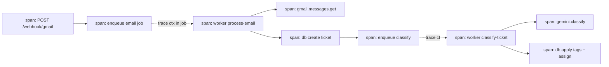

# Tier 4 — Observability (Metrics, Logs, Traces)

> **Goal:** Make the system observable end‑to‑end — Prometheus metrics, Grafana dashboards,
> OpenTelemetry distributed tracing, structured logs, and Kubernetes‑ready health probes.
> **Primary skill:** Observability / SRE. **Effort:** M–L. **Depends on:** T1, T2. **Cost:** free/local.

## Why this tier (real gap)

The system has **pino structured logs + a `requestId`** correlation id (good foundation) but **no
metrics and no tracing**. You can't answer "how deep is the email queue?", "p95 ticket‑create latency?",
"how long do Gemini calls take?", or "trace one email from webhook → ticket → classification". This tier
turns the event‑driven pipeline into something you can *see*.

## Résumé value

- "Instrumented an event‑driven pipeline with Prometheus/Grafana and OpenTelemetry distributed tracing
  spanning HTTP → BullMQ → Postgres → external APIs; built dashboards for queue depth, job throughput/
  latency, error rates, and AI classification time, with trace‑to‑log correlation via request id."

## Scope

**In:** `/metrics` endpoint (prom-client), HTTP + BullMQ + DB + Gemini metrics, OTel tracing across
process boundaries (webhook → queue → worker), Grafana + Prometheus + (optional) Tempo/Jaeger via
Compose, dashboards as code, readiness/liveness probes.
**Out:** paid APM (Datadog/New Relic) — local OSS stack instead.

## Plan / tasks

### Metrics
1. **`[ ]` Add `prom-client`** to the API; expose `GET /metrics` (guarded/internal).
2. **`[ ]` HTTP metrics** — request count/duration histogram by route+status (wrap the existing pino
   access‑log middleware or add a metrics middleware). Expose default Node process metrics.
3. **`[ ]` BullMQ metrics** — gauge **queue depth** (waiting/active/failed/completed) per queue, job
   processing duration histogram, retries counter. Use `QueueEvents`/`queue.getJobCounts()` sampled on
   an interval. These power the HPA in T6.
4. **`[ ]` Domain metrics** — Gemini call latency histogram + success/failure counter; tickets created
   counter (by source); emails processed/deduped counters.

### Tracing
5. **`[ ]` OpenTelemetry SDK** — `@opentelemetry/sdk-node` with auto‑instrumentations (HTTP, Express,
   ioredis, pg). Export OTLP to a local **Tempo** or **Jaeger**.
6. **`[ ]` Propagate context across the queue boundary** — inject trace context into BullMQ job data on
   enqueue (webhook/HTTP span) and extract it in the worker so one email = **one connected trace**:
   `webhook → enqueue → worker fetch → DB write → enqueue classify → Gemini → DB`.
7. **`[ ]` Correlate traces ↔ logs** — include `trace_id`/`span_id` alongside the existing `requestId`
   in pino log lines.

### Dashboards & health
8. **`[ ]` Compose observability stack** — add Prometheus (scrape `api:5000/metrics`,
   `worker` metrics), Grafana (provisioned datasource + dashboards as JSON in‑repo), Tempo/Jaeger.
9. **`[ ]` Dashboards as code** — `observability/grafana/dashboards/*.json`: API latency/error rate,
   queue depth + job latency, Gemini latency, email funnel.
10. **`[ ]` Probes** — keep `GET /api/health` (liveness) and add `GET /api/ready` (checks Postgres +
    Redis reachable) for K8s readiness gating in T6.

## Trace shape (the money diagram for your portfolio)

## Definition of Done (demoable)

- `http://localhost:9090` (Prometheus) shows `bullmq_queue_waiting{queue="email-processing"}` etc.
- `http://localhost:3000` (Grafana) shows the dashboards live‑updating while you send a test email.
- One inbound email produces a **single linked trace** in Jaeger/Tempo from webhook to classification.
- `GET /api/ready` returns 503 when Redis/Postgres is down (validate by stopping a container).
- Screenshots of dashboards + a trace waterfall → put them in your project README.

## Risks & gotchas

- Trace context must travel **inside the BullMQ job payload** (workers are a different process) — naive
  auto‑instrumentation won't cross the queue for you.
- Don't expose `/metrics` publicly; bind internally or protect it.
- Histogram cardinality: label by route *template*, not raw URL, to avoid metric explosion.

## Cost

100% free/local (Prometheus, Grafana, Jaeger/Tempo are OSS).
</content>
