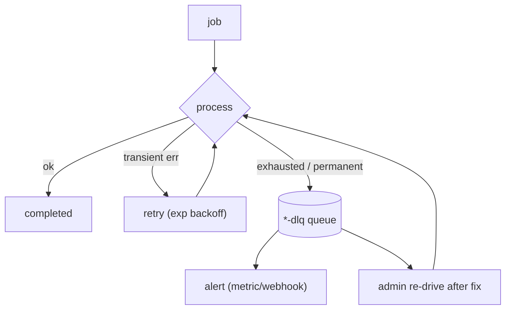

# Tier 5 — Reliability & Resilience Engineering

> **Goal:** Make the async pipeline and deploys fault‑tolerant: dead‑letter queue + alerting, retry/
> backoff tuning, idempotency, graceful shutdown, and a documented HA topology. **Primary skill:** SRE /
> Reliability. **Effort:** M. **Depends on:** T2, T4. **Cost:** free/local.

## Why this tier (real gap)

The async plane is functional but fragile under failure:

- **Failed BullMQ jobs just accumulate** in the failed set (`removeOnFail: {count: 5000}`) — there is
  **no dead‑letter queue, no alerting, no re‑drive**, and no dashboard to inspect them.
- **No graceful shutdown** — on deploy/SIGTERM, in‑flight jobs and HTTP requests are dropped.
- **`ticketNumber` race** is a latent data‑integrity bug under concurrency.
- **Single Redis / single Postgres** are SPOFs; behavior under their loss is undocumented.

## Résumé value

- "Hardened a distributed job pipeline: added a dead‑letter queue with alerting and an admin re‑drive
  path, tuned exponential‑backoff retries with idempotency keys, implemented graceful shutdown for
  zero‑drop deploys, fixed a per‑tenant sequence race, and documented an HA topology with failover
  behavior."

## Scope

**In:** DLQ + Bull Board, alert hooks, retry/backoff policy review, idempotency guarantees, graceful
shutdown (deep), `ticketNumber` atomicity, health/readiness wired to shutdown, HA topology doc + Redis
failover test plan, missed‑webhook reconciliation for Outlook.
**Out:** building managed HA infra (that's a cloud/T6 concern) — here it's local validation + design.

## Plan / tasks

### Dead‑letter & visibility
1. **`[ ]` Bull Board** — mount `@bull-board/express` at an admin‑guarded route to inspect waiting/
   active/failed jobs across both queues.
2. **`[ ]` DLQ pattern** — on `worker.on("failed")` after final attempt, move the job's payload to a
   dedicated `*-dlq` queue (or a `DeadLetter` table) with the error + attempt history; stop silent loss.
3. **`[ ]` Alerting** — emit a metric/counter on DLQ arrival (consumed by Tier 4 Prometheus →
   Alertmanager rule, or a simple webhook/email) when `failed` rate crosses a threshold.
4. **`[ ]` Re‑drive** — admin endpoint/script to requeue DLQ items after a fix.

### Retry / idempotency correctness
5. **`[ ]` Review backoff** — confirm/tune attempts + exponential backoff per queue; ensure transient
   (network/Gemini) vs permanent (validation) failures are treated differently (don't retry a permanent
   parse failure 3×).
6. **`[ ]` Idempotency audit** — document the existing guarantees (`jobId` dedup,
   `@@unique([messageId, workspaceId])`, `classify-{ticketId}`) and close any gap so every job is safe to
   retry/replay.
7. **`[ ]` Fix `ticketNumber` race** (if not already done in T2) — Postgres sequence per workspace or
   `$transaction`+retry on `P2002`; add a concurrency test.

### Graceful shutdown & rollout safety
8. **`[ ]` SIGTERM lifecycle** — web: stop the listener, drain in‑flight HTTP, flip `/api/ready` to 503
   first so the LB stops routing; worker: `worker.close()` (await in‑flight jobs, with a timeout),
   then close Redis/Prisma. Set sensible `terminationGracePeriod` in T6.
9. **`[ ]` Connection resilience** — verify ioredis auto‑reconnect + Prisma pool behavior; add
   retry/backoff around boot‑time connections; fail fast (and exit non‑zero) if required env/secrets are
   missing so a misconfigured replica doesn't serve traffic.

### HA design & failure validation
10. **`[ ]` HA topology doc** — `devops-roadmap/notes/ha-topology.md`: Redis Sentinel/Cluster, Postgres
    primary + read replica (route reports/search reads to the replica), and what degrades when each
    fails. Tie to the failure analysis in `../architecture-review/scalability-analysis.md`.
11. **`[ ]` Outlook reconciliation** — add a periodic delta/backfill sweep so notifications missed during
    downtime are recovered (Gmail already self‑heals via persisted `historyId`).

## Failure‑handling diagram

## Definition of Done (demoable)

- Force a job to fail permanently → it lands in the DLQ, fires an alert, and is visible in Bull Board;
  re‑drive replays it successfully.
- `docker compose stop` / SIGTERM a worker mid‑job → the in‑flight job **completes** (or requeues
  cleanly), nothing is lost.
- Stop Redis → `/api/ready` flips to 503, the LB would stop routing; restart → recovers.
- Concurrency test proves no duplicate `ticketNumber`.

## Risks & gotchas

- Graceful shutdown must flip readiness **before** draining, or the LB keeps sending traffic to a
  closing pod.
- DLQ must store enough context (payload + error + attempts) to actually re‑drive.
- Alert thresholds need tuning to avoid noise.

## Cost

Free/local (Bull Board, Alertmanager are OSS; HA infra is design + local failover simulation).
</content>
