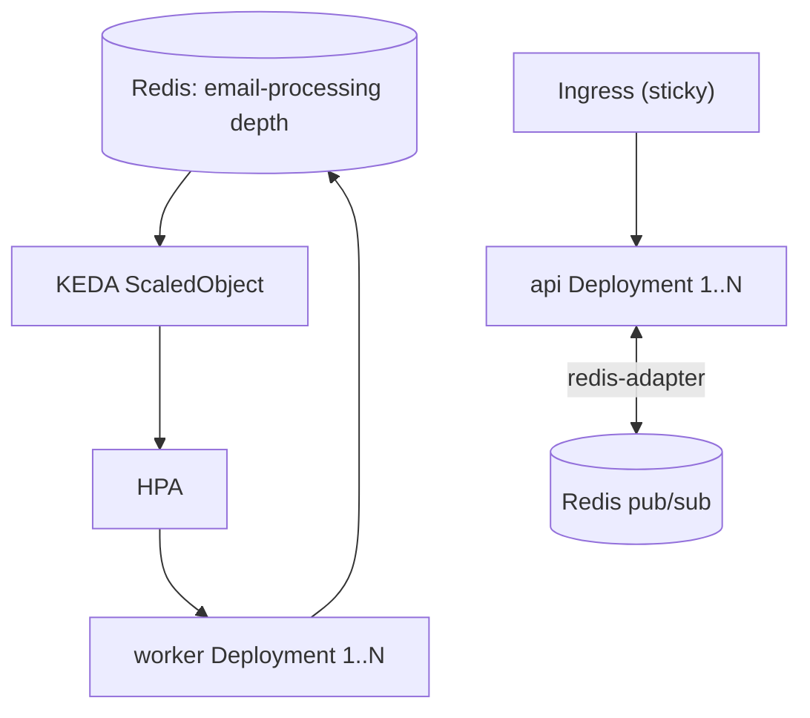

# Tier 6 — Kubernetes, IaC & Autoscaling

> **Goal:** Run the decomposed system on Kubernetes with a Helm chart and **autoscaling driven by Redis
> queue depth**, and provision infra declaratively with Terraform. **Primary skill:** Orchestration /
> IaC. **Effort:** L. **Depends on:** T1, T2, T4. **Cost:** free/local (kind/minikube).

## Why this tier (real gap)

There is **no orchestration, no autoscaling, no IaC**. Tiers 1–2 produced container images and a
web/worker split; this tier runs them like production: declarative deployments, health‑gated rollouts,
and horizontal autoscaling that reacts to **queue depth** (the metric that actually matters for an
email/AI pipeline — not just CPU).

## Résumé value

- "Deployed a multi‑service app to Kubernetes via a Helm chart with health‑gated rolling updates and
  **Horizontal Pod Autoscaling keyed on Redis/BullMQ queue depth** (KEDA), and codified the cloud infra
  (managed Postgres, Redis, DNS, S3) with Terraform modules."

## Scope

**In:** local cluster (kind/minikube), Deployments for `web`, `api`, `worker`; Services/Ingress;
ConfigMaps/Secrets; liveness/readiness probes; rolling‑update strategy; **HPA/KEDA** on queue depth;
a one‑shot `migrate` Job; Helm chart; Terraform for the cloud equivalent (modules, not necessarily
applied).
**Out:** a paid cloud bill — everything demoable on a local cluster; Terraform can `plan` without `apply`.

## Plan / tasks

### Kubernetes manifests
1. **`[ ]` Local cluster** — `kind`/`minikube`; load the T1 images.
2. **`[ ]` Deployments** —
   - `api`: `RUN_BACKGROUND_WORKERS=false`, readiness `/api/ready`, liveness `/api/health`, multiple
     replicas, `RollingUpdate` with `maxUnavailable: 0`.
   - `worker`: `command: ["node","dist/worker.js"]`, no Service, independently scalable, sane
     `terminationGracePeriodSeconds` (pairs with T5 graceful shutdown).
   - `web`: Next.js standalone, Service + Ingress.
3. **`[ ]` Config & secrets** — ConfigMap for non‑secret env; Secret for `DATABASE_URL`, JWT/encryption
   keys, OAuth creds, `GEMINI_API_KEY` (note: use Sealed Secrets/External Secrets in real prod).
4. **`[ ]` Stateful deps** — Postgres + Redis via Helm (Bitnami) or operators for local; in cloud these
   become managed services (Terraform below).
5. **`[ ]` Migration Job** — a `Job` running `prisma migrate deploy` as a pre‑deploy step / Helm hook.
6. **`[ ]` Ingress** — host‑based routing incl. wildcard `*.supporthub.bond` for tenant subdomains;
   sticky sessions for Socket.IO (`nginx.ingress.kubernetes.io/affinity: cookie`).

### Autoscaling (the highlight)
7. **`[ ]` API HPA** — CPU/memory‑based HPA for the web tier.
8. **`[ ]` Worker autoscaling on queue depth** — install **KEDA** and add a `ScaledObject` using the
   Redis/BullMQ list length (or the Prometheus metric from T4) as the trigger:
   "scale `worker` from 1→N when `email-processing` waiting > threshold." This is the standout artifact —
   autoscaling on a domain signal, not just CPU.

### Helm & IaC
9. **`[ ]` Helm chart** — `deploy/helm/supporthub/` templatizing all of the above with `values.yaml`
   (replica counts, image tags, env, autoscaling thresholds, ingress hosts).
10. **`[ ]` Terraform** — `deploy/terraform/`: modules for managed Postgres, managed Redis, S3 bucket +
    CloudFront, DNS wildcard record, and a container platform (ECS/Fly/Render or a managed k8s). Keep it
    `plan`‑able; `apply` only if you choose to spend.

## Definition of Done (demoable)

- `kubectl get pods` shows `web`, `api` (N replicas), `worker` running; rolling update with zero
  downtime (`/api/ready` gates traffic).
- Generate a burst of email jobs → **KEDA scales `worker` up**, then back down when the queue drains
  (`kubectl get hpa` / `kubectl get pods -w` screenshot — gold for a portfolio).
- Socket.IO works across multiple `api` replicas behind the Ingress (validates T2 adapter + sticky
  sessions).
- `terraform plan` renders the cloud topology.

## Risks & gotchas

- **Sticky sessions are mandatory** for the Socket.IO polling fallback behind the Ingress.
- KEDA scaling thresholds need tuning to avoid flapping; set stabilization windows.
- Secrets in plain k8s Secrets are base64, not encrypted — call out Sealed/External Secrets for prod.
- Local kind has limited resources — keep replica counts modest for the demo.

## Cost

Free/local with kind/minikube + KEDA (all OSS). Terraform `apply` to a real cloud is the only optional
paid step.
</content>
