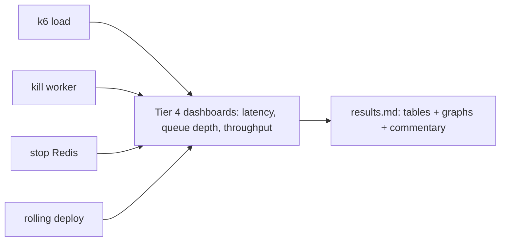

# Tier 7 — Load Testing & Chaos Engineering

> **Goal:** Prove the scaling and resilience work with numbers — k6 load tests with before/after
> throughput, and chaos experiments that demonstrate graceful recovery. **Primary skill:** Performance /
> Chaos / SRE. **Effort:** M. **Depends on:** T2, T6. **Cost:** free/local.

## Why this tier (real gap)

Every scaling claim so far is **unmeasured**. Recruiters and interviewers respond to *numbers*:
"sustained X req/s at p95 < Y ms", "throughput scaled ~linearly from 1→4 workers", "recovered in Z s
after killing a worker". This tier generates that evidence and the graphs to back it.

## Résumé value

- "Load‑tested the platform with k6 (HTTP + autoscaling triggers) and ran chaos experiments (worker
  kill, Redis failover, pod eviction); demonstrated near‑linear worker throughput scaling and
  sub‑second graceful recovery, with documented before/after benchmarks."

## Scope

**In:** k6 scripts for HTTP API and for queue/throughput; a synthetic email‑webhook load generator;
baseline vs scaled benchmarks; chaos experiments (manual `kill`/`docker stop` and/or a chaos tool);
a results writeup with graphs.
**Out:** distributed multi‑node load infra — single‑machine k6 is plenty for a portfolio.

## Plan / tasks

### Load testing
1. **`[ ]` k6 HTTP scenarios** — `loadtest/http.js`: auth (login → token), then ticket list/create/
   search under ramping VUs; assert thresholds (`http_req_duration p95`, error rate). Output to the
   Tier 4 Prometheus (k6 has a Prometheus remote‑write output) for unified dashboards.
2. **`[ ]` Pipeline throughput test** — `loadtest/email-ingest.js`: hammer the Gmail/Outlook **webhook**
   endpoints (or a seed script that enqueues jobs directly) to drive the `email-processing` queue;
   measure **jobs/sec processed** and end‑to‑end latency (webhook → ticket created).
3. **`[ ]` Scaling benchmark** — run the throughput test at `worker=1,2,4` (Compose `--scale` or K8s/KEDA)
   and record jobs/sec + p95. Produce a **before/after table + chart**. (Mock Gemini to isolate your
   pipeline from the external API rate limit for a clean curve.)

### Chaos engineering
4. **`[ ]` Worker kill** — during sustained load, `docker kill` / `kubectl delete pod` a worker; show
   no job loss (BullMQ re‑delivers; idempotency from T2/T5 makes replays safe) and that KEDA/replicas
   recover capacity.
5. **`[ ]` Redis failure** — stop Redis mid‑load; show webhooks still ACK, `/api/ready` degrades, and
   the system recovers when Redis returns (Gmail backfills via `historyId`).
6. **`[ ]` Leader‑election under chaos** — kill the cron leader and confirm another replica acquires the
   lock on the next tick (validates T2 leader election).
7. **`[ ]` Rolling‑deploy under load** — trigger a rolling update during the load test; assert zero
   dropped requests (validates T5 graceful shutdown + readiness gating).
8. **`[ ]` (Optional) chaos tooling** — Pumba (Docker) or a tiny chaos `CronJob` in K8s to randomize
   the failures.

## Experiment → evidence map

## Definition of Done (demoable)

- `loadtest/results.md` with: baseline vs scaled throughput table, a jobs/sec‑vs‑workers chart, p95
  latency under load, and chaos‑recovery timings — each with a short "what this proves" note.
- Grafana screenshots showing queue depth spiking then draining as workers autoscale.
- A one‑paragraph "scalability findings" section you can paste into your project README / résumé.

## Risks & gotchas

- **Mock external APIs** (Gemini, Gmail/Graph) during load tests, or their rate limits — not your
  system — become the bottleneck and the numbers are meaningless.
- Run k6 from a separate machine/container so the load generator doesn't starve the system under test.
- Keep tests reproducible (fixed seeds, scripted ramps) so before/after comparisons are fair.

## Cost

100% free/local (k6, Pumba are OSS; runs on your laptop).
</content>
