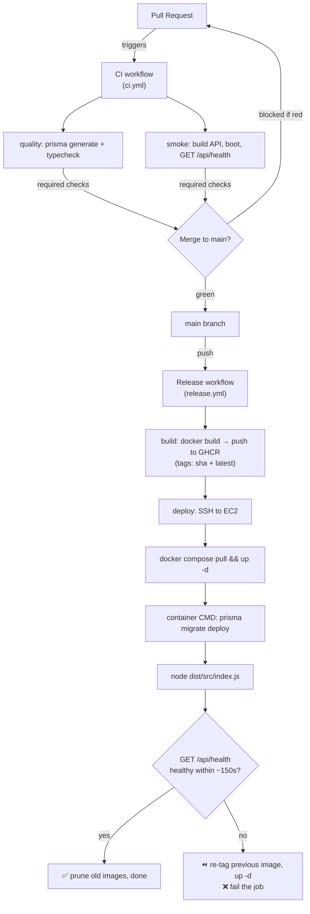
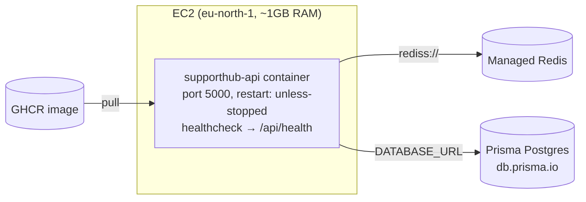

# CI/CD Pipeline

End-to-end documentation of how SupportHub is built, validated, shipped, and deployed.

- **Frontend (`apps/web`)** → auto-deploys to **Vercel** (Vercel's own Git integration; not covered in
  depth here — it builds and lints the web app on every push/PR).
- **Backend (`apps/api`)** → auto-deploys to **AWS EC2** via **GitHub Actions** + **GHCR** + **Docker**.

This document focuses on the backend pipeline, since that's the automation built in this repo.

---

## 1. High-level flow



**Two gates protect production:**

1. **Pre-merge (CI):** typecheck + a runtime smoke test must pass before a PR can merge.
2. **At deploy (release):** the new container must answer `/api/health`, or it's automatically rolled back.

---

## 2. Repository layout relevant to CI/CD

```
.
├── .github/workflows/
│   ├── ci.yml              # PR gate: typecheck + smoke test
│   └── release.yml         # main → build image → push GHCR → deploy to EC2
├── apps/
│   ├── api/
│   │   ├── Dockerfile      # multi-stage, self-migrating production image
│   │   ├── prisma/         # schema + committed migrations
│   │   └── src/index.ts    # binds PORT (default 5000); exposes /api/health
│   └── web/                # deployed by Vercel
├── docker-compose.prod.yml # runs on the EC2 box (~/deploy/)
├── docker-compose.yml      # local dev Redis only
└── .dockerignore
```

---

## 3. CI workflow — `.github/workflows/ci.yml`

**Triggers:** every `pull_request`, and `push` to `main`. Concurrent runs on the same ref cancel each other.

### Job: `quality`

```
install → prisma generate → turbo run typecheck
```

- The generated Prisma client is **gitignored**, so CI must run `prisma generate` before typechecking —
  otherwise every API type that flows through `PrismaClient` fails to resolve.
- A dummy `DATABASE_URL` is set because `prisma.config.ts` requires it, even though `generate` never connects.
- `turbo run typecheck` runs `tsc --noEmit` in `api` and `web`.

### Job: `smoke`

```
install → pnpm --filter api build → boot compiled output → curl /api/health
```

- Spins up a `redis:7-alpine` **service container** so BullMQ/Socket.IO connect cleanly.
- Builds the API exactly as production does (`prisma generate` + `tsc`), then runs the **compiled**
  `apps/api/dist/src/index.js` and polls `http://localhost:5000/api/health`.
- **Why this job exists:** `tsc`/lint compile-check the code but do **not** catch runtime-only ESM
  failures (wrong entry path, extensionless imports). Booting the real artifact does. This job was added
  precisely because two such bugs reached production before any runtime gate existed.

> **Lint is intentionally not gated here yet.** `apps/web` still uses `next lint` (removed in Next 16),
> and Vercel already lints/builds the web app on every PR. Re-add `pnpm lint` to `quality` once web
> migrates to the ESLint CLI.

---

## 4. Release workflow — `.github/workflows/release.yml`

**Triggers:** `push` to `main` affecting `apps/api/**`, `packages/**`, `pnpm-lock.yaml`, or the Dockerfile;
also `workflow_dispatch` (manual run from the Actions tab).

### Job: `build`

| Step                       | Purpose                                                                                                                   |
| -------------------------- | ------------------------------------------------------------------------------------------------------------------------- |
| `docker/login-action`      | Log in to GHCR using the built-in `GITHUB_TOKEN` (no PAT needed to **push**)                                              |
| `docker/metadata-action`   | Compute tags: `type=sha` (immutable, per-commit) + `latest`                                                               |
| `docker/build-push-action` | Build `apps/api/Dockerfile` with `context: .` (needs the root lockfile + `packages/`), push to GHCR, with GHA layer cache |

Result: `ghcr.io/dhavaldudheliya/supporthub-api:<sha>` and `:latest`.

### Job: `deploy` (needs `build`)

Uses `appleboy/ssh-action` (`command_timeout: 20m` for the slow box) to run on EC2:

```bash
PREV=$(docker inspect --format '{{.Id}}' "$IMAGE:latest" || true)   # rollback target
docker login ghcr.io -u <actor> --password-stdin                    # uses GHCR_PAT (read)
docker compose -f docker-compose.prod.yml pull
docker compose -f docker-compose.prod.yml up -d
# health-gate: poll /api/health up to 30×5s (~150s)
#   healthy → docker image prune -f, done
#   not healthy → re-tag PREV as :latest, up -d (rollback), exit 1
```

**Rollback mechanism:** because the compose file pins `:latest`, rollback works by re-tagging the
previously-running image ID back to `:latest` and recreating the container. The `sha` tags also let you
roll back to any specific build manually (see §8).

---

## 5. The production image — `apps/api/Dockerfile`

Multi-stage, based on `node:22-bookworm-slim` (Debian, **not** Alpine — `bcrypt` is a native module that
needs glibc):

```
base    → enable corepack/pnpm
build   → install all deps → prisma generate (dummy DATABASE_URL) → tsc → `pnpm deploy --prod --legacy`
runtime → copy flattened prod node_modules + dist + generated client + prisma/ + prisma.config.ts
```

- **`pnpm deploy --prod --legacy`** produces a real, symlink-free `node_modules` for just the `api`
  package — the standard answer to Dockerizing one package in a pnpm monorepo. `--legacy` is required
  because pnpm v10 refuses to deploy a non-injected workspace by default.
- **Entry point:** `tsc` preserves the `src/` folder, so the compiled entry is `dist/src/index.js`
  (not `dist/index.js`).
- **Self-migrating CMD:**
  ```dockerfile
  CMD ["sh", "-c", "npx prisma migrate deploy && node dist/src/index.js"]
  ```
  `migrate deploy` only applies committed migration files and is idempotent, so re-running on every
  container start is safe. `prisma` is a runtime **dependency** (not devDependency) so the CLI ships in
  the image.

---

## 6. Runtime topology — `docker-compose.prod.yml` (on the EC2 box, `~/deploy/`)



- Only the **API** container runs in compose. **Redis and Postgres are managed/hosted** (not containers):
  - Postgres → **Prisma Postgres** (`db.prisma.io`), via `DATABASE_URL`.
  - Redis → managed instance, via `REDIS_URL` (`rediss://…`); `ioredis` auto-enables TLS on the `rediss` scheme.
- `restart: unless-stopped` makes Docker the process supervisor (PM2 was retired).
- The compose `healthcheck` curls `/api/health` so `up -d` can report container health.

---

## 7. Secrets & configuration

| Where                      | Holds                 | Examples                                                            |
| -------------------------- | --------------------- | ------------------------------------------------------------------- |
| **GitHub Actions secrets** | CI/deploy credentials | `EC2_HOST`, `EC2_USER`, `EC2_SSH_KEY`, `GHCR_PAT` (read:packages)   |
| (built-in)                 | image push            | `GITHUB_TOKEN` (auto, `packages: write`)                            |
| **`~/deploy/.env` on EC2** | runtime app config    | `DATABASE_URL`, `REDIS_URL`, JWT/encryption keys, OAuth creds, SMTP |

**Secrets are never baked into the image** — they're injected at runtime via `env_file` in compose, and
`.env*` is in `.dockerignore`.

---

## 8. Operational runbook

### Deploy

Merge to `main` (touching backend paths). The pipeline does the rest. Watch progress in the **Actions** tab.

### Watch a live deploy on the box

```bash
cd ~/deploy
docker compose -f docker-compose.prod.yml logs -f api
# look for: "No pending migrations" → "Redis connected" → "Server is running on http://localhost:5000"
curl localhost:5000/api/health     # {"status":"ok",...}
```

### Manual rollback to a specific build

```bash
cd ~/deploy
docker pull ghcr.io/dhavaldudheliya/supporthub-api:sha-<good-commit>
docker tag  ghcr.io/dhavaldudheliya/supporthub-api:sha-<good-commit> \
            ghcr.io/dhavaldudheliya/supporthub-api:latest
docker compose -f docker-compose.prod.yml up -d
```

### Re-run a failed deploy without rebuilding

Actions → the failed run → **Re-run jobs → Re-run failed jobs** (reuses the image already in GHCR).

---

## 9. First-time setup checklist

1. **GitHub secrets:** `EC2_HOST`, `EC2_USER`, `EC2_SSH_KEY` (dedicated deploy key), `GHCR_PAT` (read:packages).
2. **EC2 box:** install Docker + compose plugin; put `docker-compose.prod.yml` and a populated `.env` in `~/deploy/`.
3. **Security group:** allow inbound SSH (port 22) from the deploy source (see §11 debt note).
4. **Retire PM2** so it doesn't hold port 5000: `pm2 delete api && pm2 save`.
5. **Branch protection:** Settings → Branches → require status checks `quality` + `smoke` on `main`.

---

## 10. Troubleshooting (issues actually hit, and fixes)

| Symptom                                                                                | Cause                                              | Fix                                               |
| -------------------------------------------------------------------------------------- | -------------------------------------------------- | ------------------------------------------------- |
| `dial tcp …:22: i/o timeout` in deploy                                                 | EC2 security group didn't allow GitHub runner IPs  | Open SSH 22 to the runner source (see §11)        |
| `Cannot find module '/app/dist/index.js'`                                              | `tsc` emits to `dist/src/index.js`                 | `CMD … node dist/src/index.js`                    |
| `Cannot find module '…/generated/prisma/client'` (runtime)                             | extensionless ESM import; `node` needs `.js`       | add `.js` to the import                           |
| `Cannot resolve env var DATABASE_URL` during build                                     | `prisma.config.ts` resolves it even for `generate` | set a dummy `DATABASE_URL` in the build stage     |
| `ERR_PNPM_DEPLOY_NONINJECTED_WORKSPACE`                                                | pnpm v10 deploy guard                              | `pnpm deploy --legacy`                            |
| CI typecheck: cascade of `implicitly any` / `Cannot find …/generated/prisma/client.js` | generated client missing on fresh checkout         | run `prisma:generate` before typecheck            |
| Very slow first image pull                                                             | 1GB image, first pull, small box                   | one-time cost; layer cache makes later pulls fast |

---

## 11. Known debt & future improvements

- **🔴 SSH open to `0.0.0.0/0`:** opened to unblock GitHub-hosted runners (no fixed IPs). Mitigated by
  key-only auth. **Proper fix:** AWS SSM Session Manager → close port 22 entirely.
- **Image size (~1GB):** trim `node_modules` (heavy SDKs) and/or push to **AWS ECR in eu-north-1** for
  much faster same-region pulls.
- **Full lint gate:** migrate `apps/web` off `next lint` (Next 16 removed it), then re-enable `pnpm lint` in CI.
- **Manual-approval gate:** put the deploy behind `environment: production` for a confirmation step.
- **Ephemeral-Postgres migration check:** run `prisma migrate deploy` against a throwaway Postgres in CI
  to prove migrations apply from clean (roadmap Tier 3, task 2).

See [`devops-roadmap/`](../devops-roadmap/README.md) for the broader phased plan (observability,
reliability, Kubernetes/IaC, load/chaos testing).
